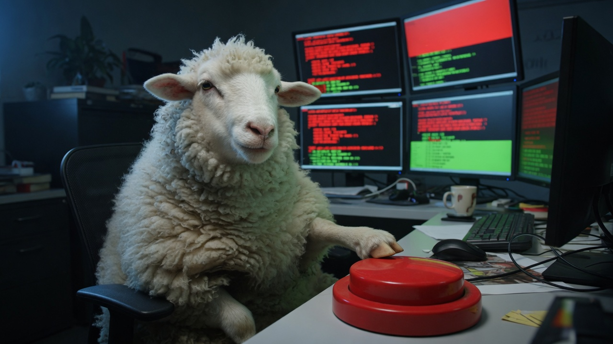
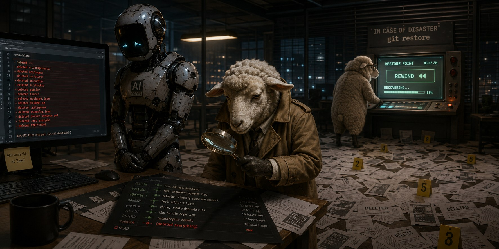

<h1 align="center">Sheep</h1>

<p align="center"><strong>Undo for AI coding agents.</strong></p>

<p align="center">
  <a href="https://github.com/gokay-ai/sheep/actions/workflows/ci.yml"></a>
  <a href="https://github.com/gokay-ai/sheep/releases/latest"></a>
  
</p>

<p align="center">Linux and macOS · <a href="https://herdr.dev">herdr</a> 0.8+</p>

<p align="center">
  
</p>

An agent just rewrote a pile of files. `prefix+f`, pick the turn before it, `shift+R`. Sheep rewinds **that** worktree — not the others — and writes a `[sheep]` prompt into the pane so the agent does not keep editing a tree that is gone.

- **Every turn is a checkpoint.** The recorder files one when the agent finishes. No `snap` unless you want one by hand.
- **One worktree, one rewind.** herdr gave that agent its own tree. Sheep only restores that tree, and only the paths in the plan you just read.
- **Notify is on.** After a restore, the agent is told which turn you went back to, how many paths moved, and to re-read before it edits. Press `n` to mute it.
- **Dry run is the product.** Nothing is written until `shift+R` (or `--yes`). A restore that fails partway is put back. The undo is itself a turn.
- **Never writes your `.git`.** Ignored files (`.env`, `node_modules/`) are never captured and never overwritten.

## Install

```bash
herdr plugin install gokay-ai/sheep/herdr-plugin
```

Checksum-verified binary. No Rust. Recorder, dock, and keys land in one command.

If herdr is already running: `herdr server reload-config`.
`command not found` means `~/.local/bin` is not on PATH.

## Keys

| herdr | action |
|---|---|
| `prefix+F` | dock |
| `prefix+f` | rewind |

Neither chord is a herdr default.

| dock | action |
|---|---|
| `j` `k` | move |
| `enter` | plan |
| `shift+R` | restore |
| `n` | notify on/off |
| `?` | all keys |

```text
 sheep  sheep                                                                          ready
timeline claude · 5 turns · newest just now · notify on
╭ timeline ────────────────────────────────────────────────────────────────────────────────╮
│▌#5   manual     claude                                                b22d9624 · just now│
│▌  10 files   +10 −75   ████████████                                                      │
│▌  extract the retry helper and use it everywhere                                         │
│▌  b22d96246056 · 2026-08-26 08:24 UTC                                                    │
│ #4   manual     claude                                                  ca196040 · 1m ago│
│   1 file   +1 −1   █                                                                     │
│   lower the reconnect ceiling to 20s                                                     │
│ #3   manual     claude                                                  82aaad15 · 2m ago│
│   2 files   +3 −0   █                                                                    │
│   add a theme helper                                                                     │
│ #2   manual     claude                                                  2c937eb2 · 4m ago│
│   1 file   +2 −0   █                                                                     │
│   cap the note length                                                                    │
╰───────────────────────────────────────────────────────────────────────────────────── 1/5 ╯
j/k move · enter rewind · ? keys · q quit · n notify · r refresh
```

<p align="center">
  
</p>

## Configure

Keys live in `~/.config/herdr/config.toml` under `# --- sheep-keys ---`. Edit a `key =` line, then `herdr server reload-config`.

```toml
[[keys.command]]
key = "prefix+f"
type = "plugin_action"
command = "sheep.rewind"

[[keys.command]]
key = "prefix+F"
type = "plugin_action"
command = "sheep.dock"
```

## CLI

```bash
sheep doctor             # is this worktree safe
sheep log                # the timeline
sheep diff '#3'          # what restoring would do
sheep restore '#3' --yes # go back
```

MIT. How it works: [`docs/architecture.md`](docs/architecture.md). Contributing: [`AGENTS.md`](AGENTS.md).

Uninstall: `herdr plugin uninstall sheep`. Delete the `sheep-keys` block and `~/.local/bin/sheep` yourself. Without herdr, download a [release](https://github.com/gokay-ai/sheep/releases/latest).
